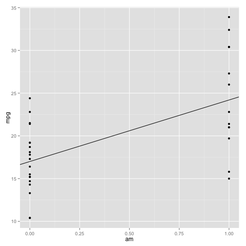
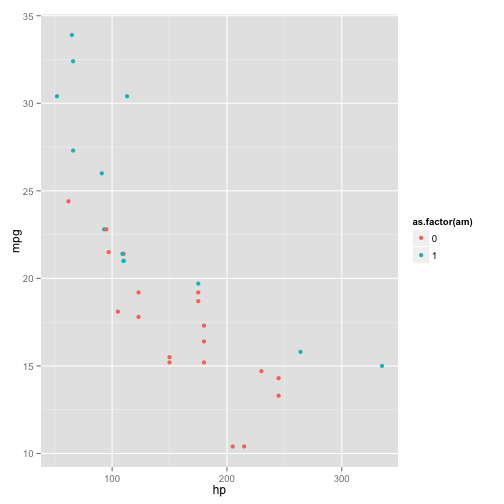
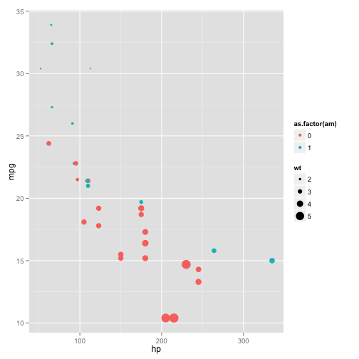
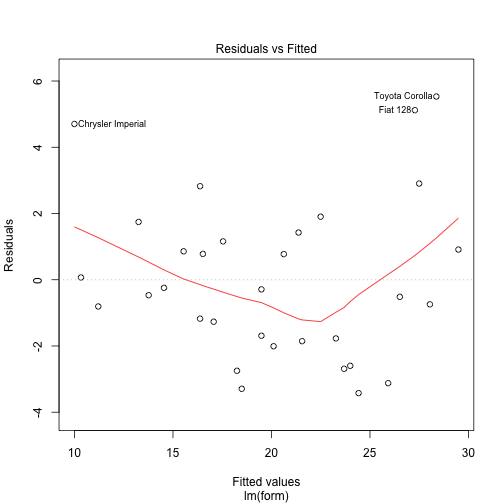
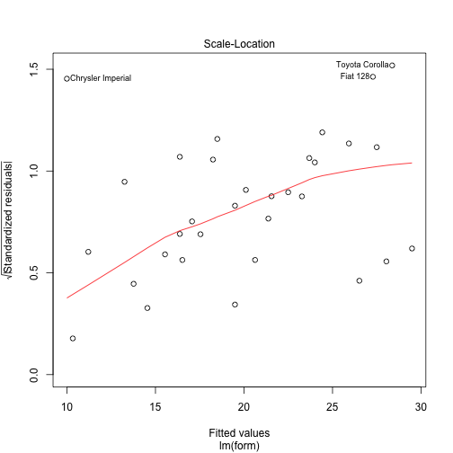
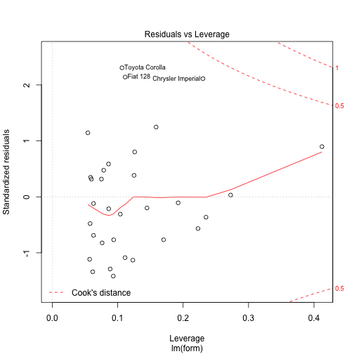

The Effect of Transmission on Fuel Economy
==========================================

The purpose of this analysis is to quantify the relationship between vehicle
transmission and fuel economy, measured in miles per gallon (mpg). The data 
we use is taken from the `mtcars` dataset included in the R programming language
. This data is taken from the 1974 Motor Trend magazine, and details 11 aspects
of motor vehicle design and performance, including:

1. Fuel economy (in miles per gallon)
2. Number of cylinders
3. Engine displacement (in cubic inches)
4. Horsepower
5. Rear axle ratio
6. Weight (in thousands of pounds)
7. Quarter mile time (in seconds)
8. Cylinder arrangement (either V or straight)
9. Transmission (either automatic or manual)
10. Number of forward gears
11. Number of carburetors

First, we load the `ggplot2` graphics library and the `mtcars` dataset.

```r
library(ggplot2)
data(mtcars)
```


Next, we examine the pairwise relationship between the variables.

```r
plot(mtcars)
```

 

We find that there is a slight difference in fuel economy between manual and
automatic transmissions. We also see that there is a fair amount of covariation
in the columns. This can be problematic for linear regression, as omitting
interaction terms can make models less accurate, but including these terms makes
linear models much harder to interpret.

We will fit a linear model in a stepwise fashion, starting with transmission
type. To maintain the interpretability of our model, we will not include
interaction terms. To limit the effect of the corelation between variables, we 
will limit our model to 3 predictors.

First, we create a one-predictor model based on transmission type.

```r
mpg_am <- lm(mpg ~ am, data = mtcars)
summary(mpg_am)
```

```
## 
## Call:
## lm(formula = mpg ~ am, data = mtcars)
## 
## Residuals:
##    Min     1Q Median     3Q    Max 
## -9.392 -3.092 -0.297  3.244  9.508 
## 
## Coefficients:
##             Estimate Std. Error t value Pr(>|t|)    
## (Intercept)    17.15       1.12   15.25  1.1e-15 ***
## am              7.24       1.76    4.11  0.00029 ***
## ---
## Signif. codes:  0 '***' 0.001 '**' 0.01 '*' 0.05 '.' 0.1 ' ' 1
## 
## Residual standard error: 4.9 on 30 degrees of freedom
## Multiple R-squared:  0.36,	Adjusted R-squared:  0.338 
## F-statistic: 16.9 on 1 and 30 DF,  p-value: 0.000285
```

```r

ggplot(mtcars, aes(x = am, y = mpg)) + geom_point() + geom_abline(intercept = 17, 
    slope = 7.2)
```

 

We see that there is a definite separation between the means of the manual and automatic cars. However, our model does not do a good job of separating our values; the R squared
is only 0.338.

To account for that unexplained variance, we will add predictors in a stepwise fashion. 
This involves fitting a new model adding each column one at a time, and comparing the R squared for each new model.


```r
# From the list of columns, remove the two already in the model
variablesLeft <- setdiff(names(mtcars), c("mpg", "am"))

# Insert each column into the regression model and determine the fit.
models1 <- lapply(variablesLeft, FUN = function(x) {
    form <- paste0("mpg ~ am + ", x)
    lm(form, data = mtcars)
})

# Display the column names next to the R squared from each model
cbind(variablesLeft, adj.r.squared = sapply(models1, FUN = function(x) summary(x)$adj.r.squared))
```

```
##       variablesLeft adj.r.squared      
##  [1,] "cyl"         "0.742393789059248"
##  [2,] "disp"        "0.714940511298249"
##  [3,] "hp"          "0.767002539013904"
##  [4,] "drat"        "0.455438627843664"
##  [5,] "wt"          "0.735788906182185"
##  [6,] "qsec"        "0.665242518058093"
##  [7,] "vs"          "0.664432984586211"
##  [8,] "gear"        "0.315693035443246"
##  [9,] "carb"        "0.683236222808786"
```

```r

summary(models1[[3]])
```

```
## 
## Call:
## lm(formula = form, data = mtcars)
## 
## Residuals:
##    Min     1Q Median     3Q    Max 
## -4.384 -2.264  0.137  1.697  5.866 
## 
## Coefficients:
##             Estimate Std. Error t value Pr(>|t|)    
## (Intercept) 26.58491    1.42509   18.65  < 2e-16 ***
## am           5.27709    1.07954    4.89  3.5e-05 ***
## hp          -0.05889    0.00786   -7.50  2.9e-08 ***
## ---
## Signif. codes:  0 '***' 0.001 '**' 0.01 '*' 0.05 '.' 0.1 ' ' 1
## 
## Residual standard error: 2.91 on 29 degrees of freedom
## Multiple R-squared:  0.782,	Adjusted R-squared:  0.767 
## F-statistic:   52 on 2 and 29 DF,  p-value: 2.55e-10
```

```r

ggplot(mtcars, aes(x = hp, y = mpg, color = as.factor(am))) + geom_point()
```

 

We find that the model evaluating horsepower has the highest R squared statistic. We repeat the process to find the second predictor to add to the model.


```r
variablesLeft <- setdiff(variablesLeft, "hp")
models2 <- lapply(variablesLeft, FUN = function(x) {
    form <- paste0("mpg ~ am + hp + ", x)
    lm(form, data = mtcars)
})

cbind(variablesLeft, adj.r.squared = sapply(models2, FUN = function(x) summary(x)$adj.r.squared))
```

```
##      variablesLeft adj.r.squared      
## [1,] "cyl"         "0.783149672433724"
## [2,] "disp"        "0.777692498041191"
## [3,] "drat"        "0.771550853410482"
## [4,] "wt"          "0.822735694896529"
## [5,] "qsec"        "0.765444768543417"
## [6,] "vs"          "0.784794821358682"
## [7,] "gear"        "0.76601419103947" 
## [8,] "carb"        "0.774672634018999"
```

```r

summary(models2[[4]])
```

```
## 
## Call:
## lm(formula = form, data = mtcars)
## 
## Residuals:
##    Min     1Q Median     3Q    Max 
## -3.422 -1.792 -0.379  1.225  5.532 
## 
## Coefficients:
##             Estimate Std. Error t value Pr(>|t|)    
## (Intercept) 34.00288    2.64266   12.87  2.8e-13 ***
## am           2.08371    1.37642    1.51  0.14127    
## hp          -0.03748    0.00961   -3.90  0.00055 ***
## wt          -2.87858    0.90497   -3.18  0.00357 ** 
## ---
## Signif. codes:  0 '***' 0.001 '**' 0.01 '*' 0.05 '.' 0.1 ' ' 1
## 
## Residual standard error: 2.54 on 28 degrees of freedom
## Multiple R-squared:  0.84,	Adjusted R-squared:  0.823 
## F-statistic:   49 on 3 and 28 DF,  p-value: 2.91e-11
```

```r

ggplot(mtcars, aes(x = hp, y = mpg, color = as.factor(am))) + geom_point(aes(size = wt))
```

 

```r

plot(models2[[4]])
```

    

We find that weight explains the most variance in the rest of the data.
Holding these two covariates constant, we find that the difference between manual and automatic transmission fuel economy is no longer significant.

The major drawback to this analysis is that by ignoring interaction terms, we reduce the power of the analysis in order to make the interpretation of th emodel easier. As such, our conclusion of a lack of relation between mpg and transmission type must be taken cautiously. A study with a larger sample size may yield better results.
